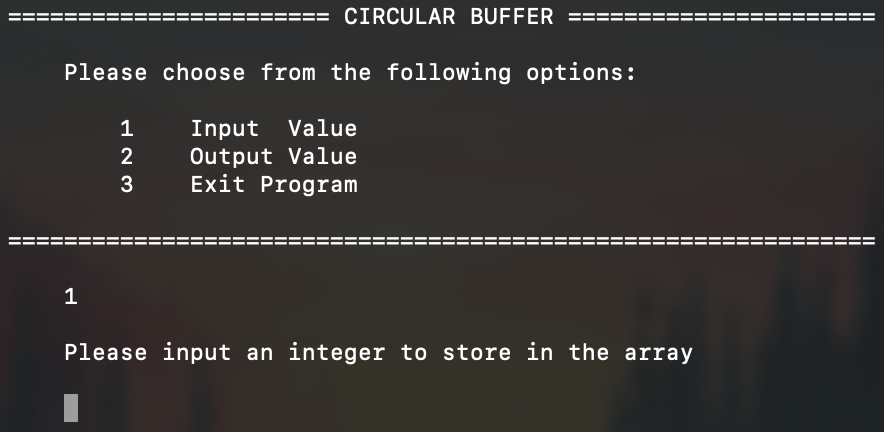

# Circular-Buffer
This is a simple implementation of a circular buffer, built in C and executed as a console application. It allows the user to write values to the buffer and read values from the buffer.

# Motivation
This was an extension of a simple lab for my Data Structures class. A friend was struggling with the concept of circular buffers, so I wrote up a guide for a basic implementation.
Here's a link to the blog post:
- https://medium.com/@charlesdobson/how-to-implement-a-simple-circular-buffer-in-c-34b7e945d30e

# Build Status
All basic functionality has been added.

# Screenshots

# Tech
- C
